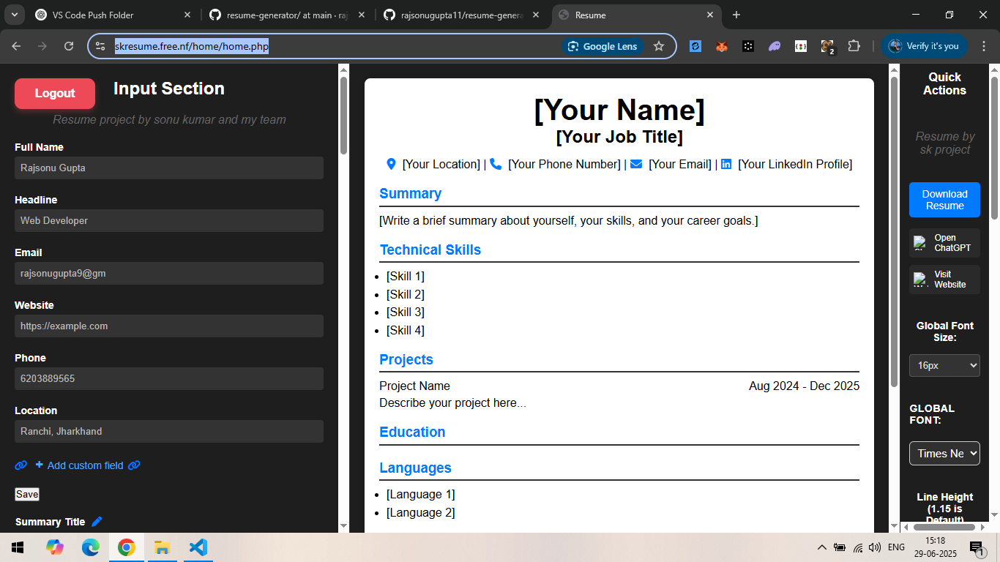
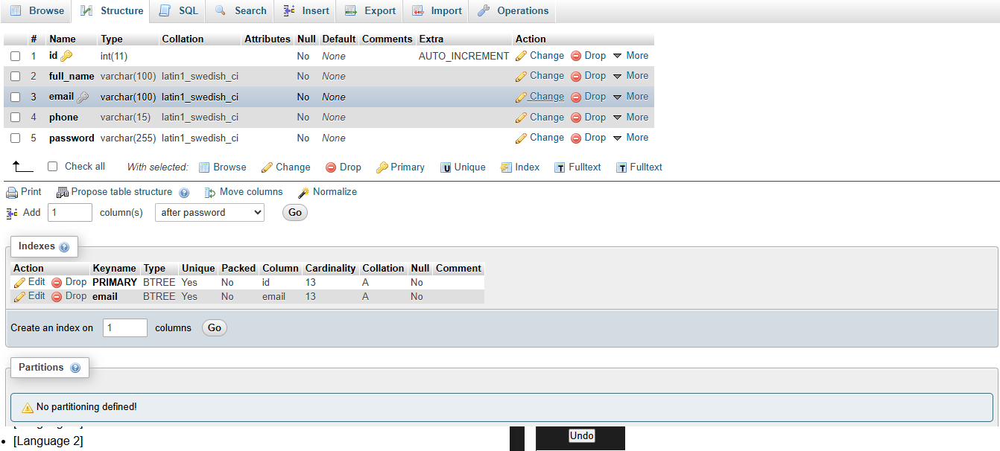

# 🧾 Resume Generator Web App

A fully functional **Resume Generator** web application that allows users to create, customize, preview, and download professional resumes instantly — all in one page!

🔗 **Live Demo**: [https://skresume.free.nf/home/home.php](https://skresume.free.nf/home/home.php)

---

## ✨ Features

- ✅ Real-time resume preview as you type
- 🧠 Add and customize your own fields (summary, skills, projects, education, etc.)
- 🎨 Choose font styles and sizes
- 📥 Download a clean, printer-friendly resume
- 🌐 Responsive and user-friendly interface
- 🔐 Auth system (login, signup, logout)

---

## 🛠️ Tech Stack

| Layer     | Technologies                     |
|-----------|----------------------------------|
| Frontend  | HTML5, CSS3, JavaScript          |
| Backend   | PHP                              |
| Database  | MySQL (via XAMPP - optional)     |
| Hosting   | [InfinityFree](https://infinityfree.net) (Free Forever) |

---

## 🚀 How to Run Locally

1. Clone the repo:
   ```bash
   git clone https://github.com/rajsonugupta11/resume-generator.git


   ## 🔍 Screenshots

### 🧾 Input Form:


### 📄 Resume Preview:


